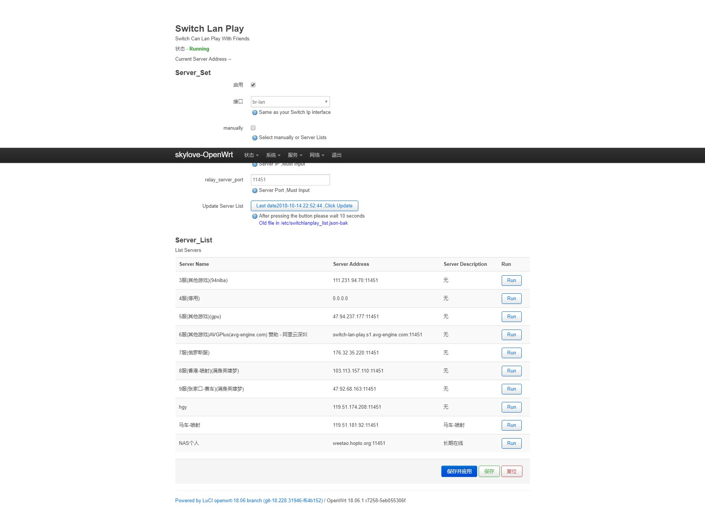

# Luci-app-switch-lan-play
@skylovebeauty


此工具用于Openwrt 下 [Switch-lan-play](https://github.com/spacemeowx2/switch-lan-play) 工具的 Luci 界面




**更新日志:**

并没有什么更新，只是学会用 git 和 markdown

上传了第一版本的可用代码

**注意事项:**

需要预先安装 [switch-lan-play](https://github.com/spacemeowx2/switch-lan-play) 和  **luci-lib-json**

# 如何应用

## 1. 编译安装方式
方法与编译 Openwrt 下的 Luci 其他插件类似


在 SDK 目录下 

```
#下载本项目
git clone  https://github.com/skylovebeauty/luci-app-switch-lan-play.git   ./package/luci-app-switch-lan-play

#确保菜单里选中了本插件
make menuconfig 

#进行编译
make ./package/luci-app-switch-lan-play/compile #e2500d==  

##拷贝并安装生成的 luci-app-switch-lan-play-xxx<版本号>.ipk 到Openwrt路由器的/tmp目录
opkg install /tmp/luci-app-switch-lan-play-xxx<版本号>.ipk  #执行安装
```

## 2. 手工安装方式

将 files 目录作为 根目录 参照，将各个文件复制到对应各个目录即可
例如:
```
cp  ./files/root/usr/lib/lua/luci/controller/switchlanplay.lua    /usr/lib/lua/luci/controller/switchlanplay.lua
cp  .//files/root/etc/init.d/switchlanplay   /etc/init.d/switchlanplay 
...
```

注意 init.d 目录下的脚本需要给予 可执行权限，即 chmod +x  <文件名>
```
chmod +x /etc/init.d/switchlanplay
```
